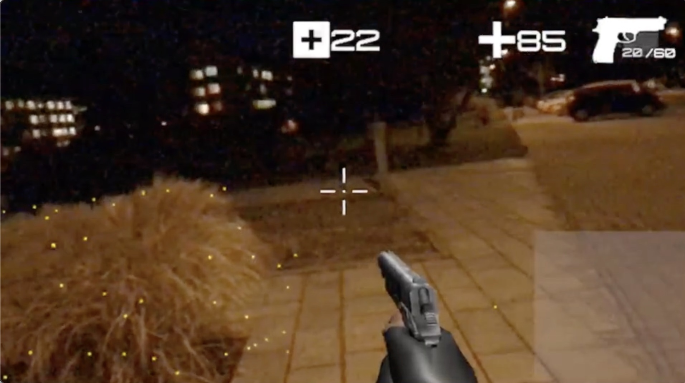
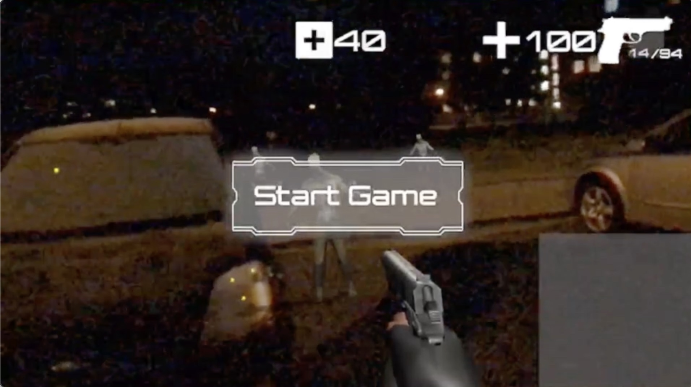
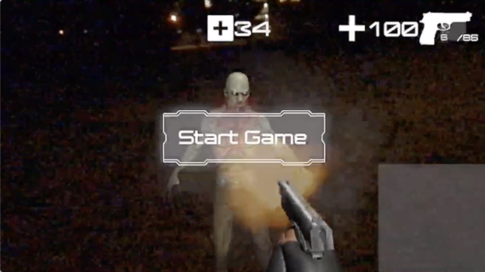

# ar-fps: Mobile-based AR First-Person Shooting Game

## Overview  
This project is a mobile-based AR first-person shooting (FPS) game developed as part of a game development course team project. The game integrates augmented reality (AR) and real-world navigation, allowing players to experience an immersive FPS battle against zombies on actual streets. Using Unity 3D and Mapbox SDK, the game generates zombies dynamically based on real-world maps and paths while ensuring they avoid real buildings and obstacles.

## Below are some in-game screenshots illustrating the gameplay experience:

### 1. Player searching zombies

### 2. Player encountering zombies

### 3. Player shooting zombies


## Features
- **World-scale AR FPS gameplay** with real-world mapping.
- **Dynamic zombie generation** on walkable paths.
- **Real-time GPS tracking** to locate the player and adjust zombie behavior.
- **Zombies move towards the player** for an immersive survival experience.
- **Weapon pickup system**: Players can find and use weapons to shoot zombies.
- **Health pickups** at designated locations to sustain player survival.

## Technical Specifications
- Unity 3D 2017.2+
- iOS 11.1+
- Xcode 9.1+
- iOS device that supports ARKit (iPhone 6S or later, iPad (2017) or later)
- Mapbox Unity SDK (MapView/GPS Location, see here [iOS library](https://github.com/mapbox/mapbox-arkit-ios))

## Gameplay Scenario
- The game is preferably played in open areas where GPS tracking is reliable.
- Players move physically in the real world to explore and locate weapons.
- Zombies are generated on walkable paths based on real-world streets and move towards the player's current position.
- Players must aim and shoot zombies to prevent attacks.
- If a zombie gets too close, it will attack and reduce the player's health.
- Players can pick up health packs at designated locations to restore health.
- The game keeps track of the number of zombies killed for the final score.

## Game Object Overview
- Zombies:
    - Health: Variable
    - Damage: Attack reduces player health
    - Speed: Adjusted based on difficulty level

- Weapons (Guns & Bullets):
    - Players pick up weapons to kill zombies.
    - Each bullet has a set damage value.

- Health Pickups:
    - Located at predefined areas in the game world.
    - Used to recover lost health.

- Winning Condition:
    - Players win by surviving and eliminating a certain number of zombies.

## Installation & Setup
- Clone this repository:
```
git clone https://github.com/yourusername/ar-fps.git
```
- Open the project in Unity 3D (2017.2+).
- Ensure you have an iOS device that supports ARKit.
- Install the Mapbox Unity SDK and configure API keys for map visualization.
-Build and run the project on an iPhone 6S or later with iOS 11.1+.
